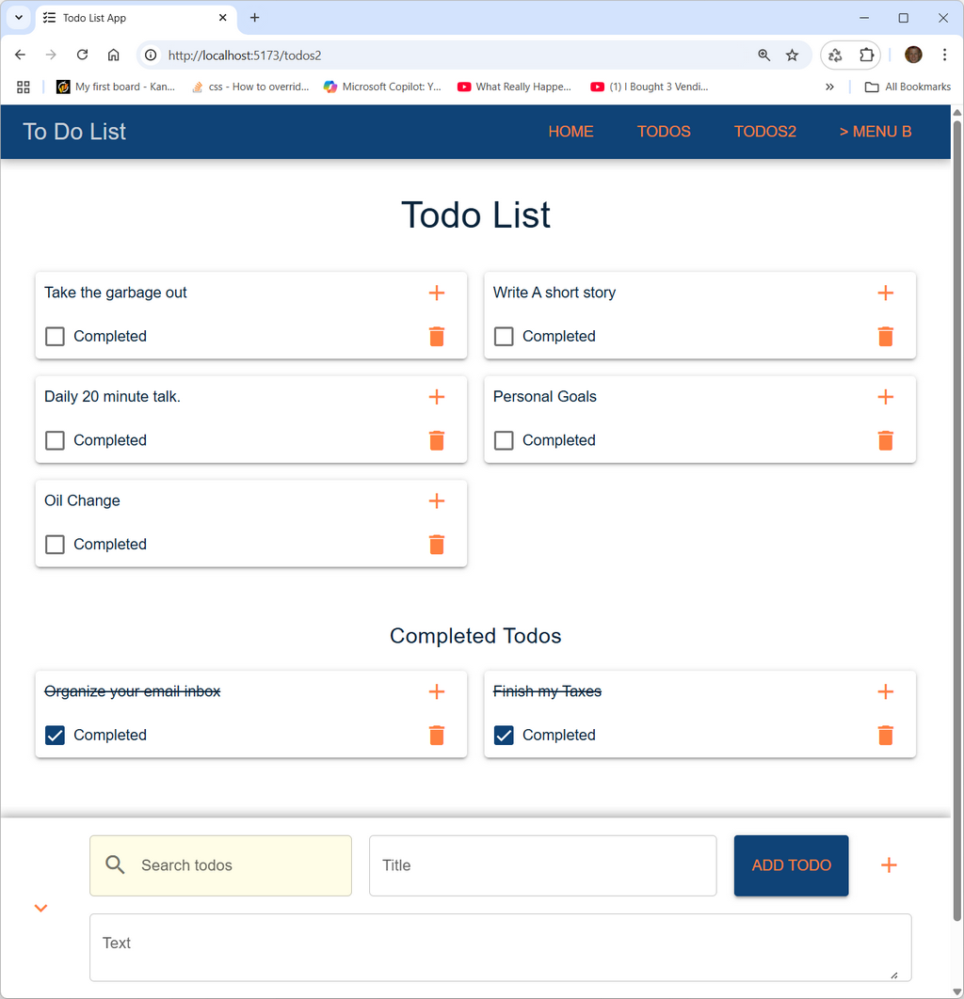

# This Todo App is built using Vue 3, Vite, Pinia, Quasar, Vue Router, and MongoDB.

Transitions

## Run backend
- > Open Terminal Window (power shell)
- > cd backend
- > npm install
- > node server.js

## Run frontend
- > Open Terminal Window (power shell)
- > cd frontend
- > npm install
- > npn run dev